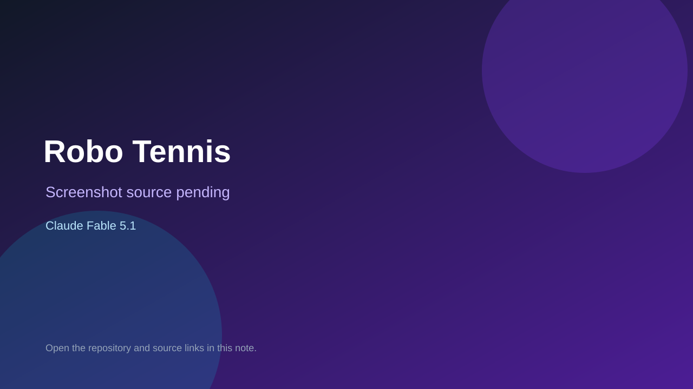

# Robo Tennis

> Verified game note.

## At a glance

- **Score:** 8.0/10
- **Model:** Claude Fable 5.1
- **Technology:** HTML, JavaScript, Browser
- **Verified:** 2026-09-09
- **Repository:** [https://github.com/sorrycc/fable-arcade](https://github.com/sorrycc/fable-arcade)
- **Evidence:** [direct model evidence](https://github.com/sorrycc/fable-arcade#games)

## Screenshots

No screenshot source is recorded yet. Keep the placeholder until a repository, awesome list, or creator source provides an image.

## Model attribution

Open the evidence link above. Evidence grade: **direct model evidence**.

## Source description

The repository README lists eight separate single-file HTML games, each with its own folder, source index.html, model/date/prompt README, GitHub Pages play URL and game-specific mechanics. The README states that each game was generated one-shot by Claude Fable 5.1 or later. The repository tree contains all eight game folders, so count eight game units under one canonical repository.

### Gameplay source

- [https://github.com/sorrycc/fable-arcade/tree/main/games/flappy-bird](https://github.com/sorrycc/fable-arcade/tree/main/games/flappy-bird)
- [https://github.com/sorrycc/fable-arcade/tree/main/games/mario-1-1](https://github.com/sorrycc/fable-arcade/tree/main/games/mario-1-1)
- [https://github.com/sorrycc/fable-arcade/tree/main/games/mario-kart-snow](https://github.com/sorrycc/fable-arcade/tree/main/games/mario-kart-snow)
- [https://github.com/sorrycc/fable-arcade/tree/main/games/robot-tennis](https://github.com/sorrycc/fable-arcade/tree/main/games/robot-tennis)
- [https://github.com/sorrycc/fable-arcade/tree/main/games/subway-runner](https://github.com/sorrycc/fable-arcade/tree/main/games/subway-runner)
- [https://github.com/sorrycc/fable-arcade/tree/main/games/crossy-farm-car](https://github.com/sorrycc/fable-arcade/tree/main/games/crossy-farm-car)
- [https://github.com/sorrycc/fable-arcade/tree/main/games/terraria-sandbox](https://github.com/sorrycc/fable-arcade/tree/main/games/terraria-sandbox)
- [https://github.com/sorrycc/fable-arcade/tree/main/games/voxel-gta-city](https://github.com/sorrycc/fable-arcade/tree/main/games/voxel-gta-city)
- [https://github.com/sorrycc/fable-arcade#games](https://github.com/sorrycc/fable-arcade#games)

## Verification notes

- **Status:** verified
- **Counted units:** 8
- **Discovery:** https://github.com/sorrycc/fable-arcade

[Back to the awesome list](../../README.md)
