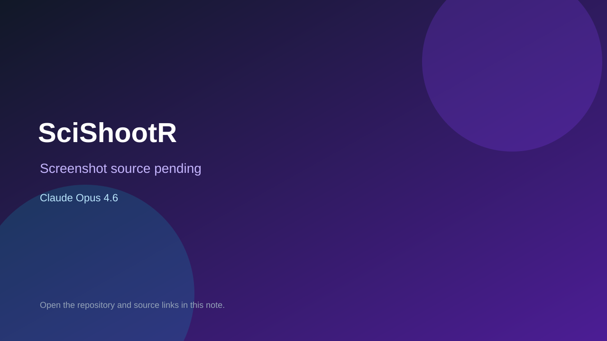

# SciShootR

> Verified game note.

## At a glance

- **Score:** 8.2/10
- **Model:** Claude Opus 4.6
- **Technology:** Unity, C#, Native
- **Verified:** 2026-09-10
- **Repository:** [https://github.com/Scottcjn/SciShootR](https://github.com/Scottcjn/SciShootR)
- **Evidence:** [direct model evidence](https://github.com/Scottcjn/SciShootR/commit/1205c7acfbca9b769f060b0eee5248c32cec0826)

## Screenshots

No screenshot source is recorded yet. Keep the placeholder until a repository, awesome list, or creator source provides an image.

## Model attribution

Open the evidence link above. Evidence grade: **direct model evidence**.

## Source description

The initial commit is titled SciShootR Unity 2D shooter source and describes the project as formerly Starship Shooter. It contains LevelsScene and MainMenu scenes plus Player, Enemy, EnemySpawner, WaveConfig, GameSession, power-up, damage, score and scene-loading scripts. The commit page shows a direct Co-Authored-By: Claude Opus 4.6 trailer.

### Gameplay source

- [https://github.com/Scottcjn/SciShootR/tree/main/Assets/Scenes](https://github.com/Scottcjn/SciShootR/tree/main/Assets/Scenes)
- [https://github.com/Scottcjn/SciShootR/tree/main/Assets/Scripts](https://github.com/Scottcjn/SciShootR/tree/main/Assets/Scripts)
- [https://github.com/Scottcjn/SciShootR/commit/1205c7acfbca9b769f060b0eee5248c32cec0826](https://github.com/Scottcjn/SciShootR/commit/1205c7acfbca9b769f060b0eee5248c32cec0826)

## Verification notes

- **Status:** verified_source
- **Counted units:** 1
- **Discovery:** GitHub commit search for Unity game Co-Authored-By Claude Opus 4.6; https://github.com/Scottcjn/SciShootR

[Back to the awesome list](../../README.md)
