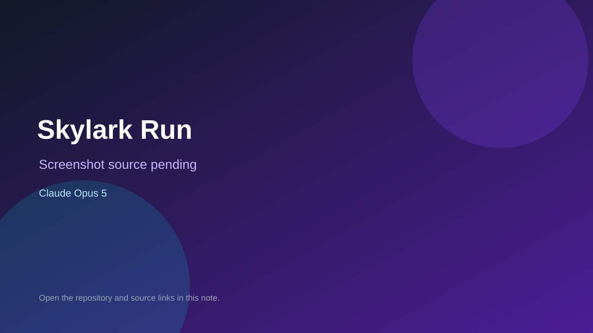

# Skylark Run

> Top-list entry: **today** (#3), **this week** (#4), **this month** (#4).

## At a glance

- **Score:** 9.6/10
- **Model:** Claude Opus 5
- **Technology:** JavaScript, Three.js, WebGL, Web Audio, Browser
- **Verified:** 2026-09-12
- **Repository:** [https://github.com/jackpepper-vibe/SkylarkRun](https://github.com/jackpepper-vibe/SkylarkRun)
- **Evidence:** [direct model evidence](https://github.com/jackpepper-vibe/SkylarkRun/commit/44f2aa94dc069523d8a4e30090231486f82d31a3)
- **Live demo:** [open demo](https://skylark-run.vercel.app)

## Screenshots

No screenshot source is recorded yet. Keep the placeholder until a repository, awesome list, or creator source provides an image.

## Model attribution

Open the evidence link above. Evidence grade: **direct model evidence**.

## Source description

The README documents an open-cockpit browser flight game with a monoplane ring course over countryside and a helicopter hover course over a night city. It documents takeoff, gates, gold gates, fuel, hazards, weather, sector progression, runway approach, landing quality, damage, local logbooks, a score board and smoke tests. The source has separate plane and helicopter flight/world/HUD modules, a shared frame loop and explicit Three.js/WebGL rendering. The live Vercel URL returned HTTP 200. The cited game-documentation commit contains an exact Co-Authored-By: Claude Opus 5 trailer. The README states that the former Rotor Run was folded into this single game, so count one unit.

### Gameplay source

- [https://github.com/jackpepper-vibe/SkylarkRun#readme](https://github.com/jackpepper-vibe/SkylarkRun#readme)
- [https://skylark-run.vercel.app](https://skylark-run.vercel.app)
- [https://github.com/jackpepper-vibe/SkylarkRun/blob/master/src/main.js](https://github.com/jackpepper-vibe/SkylarkRun/blob/master/src/main.js)
- [https://github.com/jackpepper-vibe/SkylarkRun/tree/master/src/plane](https://github.com/jackpepper-vibe/SkylarkRun/tree/master/src/plane)
- [https://github.com/jackpepper-vibe/SkylarkRun/tree/master/src/heli](https://github.com/jackpepper-vibe/SkylarkRun/tree/master/src/heli)
- [https://github.com/jackpepper-vibe/SkylarkRun/tree/master/tools](https://github.com/jackpepper-vibe/SkylarkRun/tree/master/tools)
- [https://github.com/jackpepper-vibe/SkylarkRun/commit/44f2aa94dc069523d8a4e30090231486f82d31a3](https://github.com/jackpepper-vibe/SkylarkRun/commit/44f2aa94dc069523d8a4e30090231486f82d31a3)

## Verification notes

- **Status:** verified_source
- **Counted units:** 1
- **Discovery:** GitHub commit search for game Co-Authored-By Claude Opus, 2026-09-10..2026-09-12; https://github.com/jackpepper-vibe/SkylarkRun

[Back to the awesome list](../../README.md)
