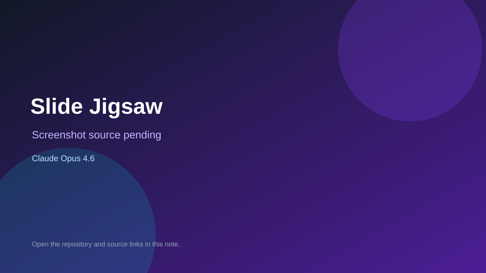

# Slide Jigsaw

> Verified game note.

## At a glance

- **Score:** 8.2/10
- **Model:** Claude Opus 4.6
- **Technology:** Cocos Creator 4, TypeScript, Native mobile
- **Verified:** 2026-09-10
- **Repository:** [https://github.com/Jinchaosss/slide-jigsaw](https://github.com/Jinchaosss/slide-jigsaw)
- **Evidence:** [direct model evidence](https://github.com/Jinchaosss/slide-jigsaw/commit/b3ea9599939f114022fee1bbb688577f8e696c94)

## Screenshots

No screenshot source is recorded yet. Keep the placeholder until a repository, awesome list, or creator source provides an image.

## Model attribution

Open the evidence link above. Evidence grade: **direct model evidence**.

## Source description

The initial commit describes a Cocos Creator 4 sliding jigsaw puzzle game and includes a main scene, puzzle controller/model/configuration, daily puzzle menu, rewards and UI helpers. The commit page shows a direct Claude Opus 4.6 trailer.

### Gameplay source

- [https://github.com/Jinchaosss/slide-jigsaw/blob/main/assets/main.scene](https://github.com/Jinchaosss/slide-jigsaw/blob/main/assets/main.scene)
- [https://github.com/Jinchaosss/slide-jigsaw/blob/main/assets/scripts/puzzle/SlidePuzzleController.ts](https://github.com/Jinchaosss/slide-jigsaw/blob/main/assets/scripts/puzzle/SlidePuzzleController.ts)
- [https://github.com/Jinchaosss/slide-jigsaw/blob/main/assets/scripts/puzzle/SlidePuzzleModel.ts](https://github.com/Jinchaosss/slide-jigsaw/blob/main/assets/scripts/puzzle/SlidePuzzleModel.ts)
- [https://github.com/Jinchaosss/slide-jigsaw/commit/b3ea9599939f114022fee1bbb688577f8e696c94](https://github.com/Jinchaosss/slide-jigsaw/commit/b3ea9599939f114022fee1bbb688577f8e696c94)

## Verification notes

- **Status:** verified_source
- **Counted units:** 1
- **Discovery:** GitHub commit search for Cocos game Co-Authored-By Claude Opus; https://github.com/Jinchaosss/slide-jigsaw

[Back to the awesome list](../../README.md)
