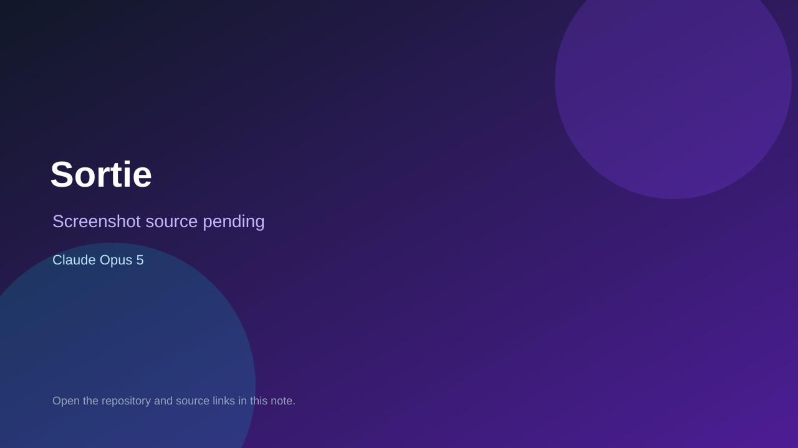

# Sortie

> Verified game note.

## At a glance

- **Score:** 9.2/10
- **Model:** Claude Opus 5
- **Technology:** Godot 4.7.2, GDScript, Native desktop, Grid tactics JRPG, Turn-based combat, GUT tests
- **Verified:** 2026-09-10
- **Repository:** [https://github.com/Attacktive/sortie](https://github.com/Attacktive/sortie)
- **Evidence:** [direct model evidence](https://github.com/Attacktive/sortie/commit/1d932dcfdc376a23d390a4fc99b4bd9455e17b89)

## Screenshots

No screenshot source is recorded yet. Keep the placeholder until a repository, awesome list, or creator source provides an image.

## Model attribution

Open the evidence link above. Evidence grade: **direct model evidence**.

## Source description

The README provides a fresh-clone Godot 4.7.2 run command, title screen, standalone walkable field, standalone battle, screenshot harness and automated tests. The current source contains a title scene, field scene with map/player/camera/NPCs/triggers, battle scene with grid movement, unit selection, attacks, turn flow, combat animation and result screens, plus mission, dialogue and save/load systems. The inspected field commit states that it boots into a walkable 18x12 world and contains an exact Co-authored-by: Claude Opus 5 trailer. Count the current vertical-slice RPG once; do not count design documents as extra games.

### Gameplay source

- [https://github.com/Attacktive/sortie/blob/main/README.md](https://github.com/Attacktive/sortie/blob/main/README.md)
- [https://github.com/Attacktive/sortie/blob/main/project.godot](https://github.com/Attacktive/sortie/blob/main/project.godot)
- [https://github.com/Attacktive/sortie/blob/main/scenes/game.tscn](https://github.com/Attacktive/sortie/blob/main/scenes/game.tscn)
- [https://github.com/Attacktive/sortie/blob/main/scenes/field.tscn](https://github.com/Attacktive/sortie/blob/main/scenes/field.tscn)
- [https://github.com/Attacktive/sortie/blob/main/scenes/battle.tscn](https://github.com/Attacktive/sortie/blob/main/scenes/battle.tscn)
- [https://github.com/Attacktive/sortie/blob/main/core/mission_registry.gd](https://github.com/Attacktive/sortie/blob/main/core/mission_registry.gd)
- [https://github.com/Attacktive/sortie/blob/main/scenes/battle.gd](https://github.com/Attacktive/sortie/blob/main/scenes/battle.gd)
- [https://github.com/Attacktive/sortie/tree/main/test](https://github.com/Attacktive/sortie/tree/main/test)
- [https://github.com/Attacktive/sortie/commit/1d932dcfdc376a23d390a4fc99b4bd9455e17b89](https://github.com/Attacktive/sortie/commit/1d932dcfdc376a23d390a4fc99b4bd9455e17b89)

## Verification notes

- **Status:** verified_source
- **Counted units:** 1
- **Discovery:** GitHub code search for Godot game Co-Authored-By Claude Opus 5; https://github.com/Attacktive/sortie

[Back to the awesome list](../../README.md)
