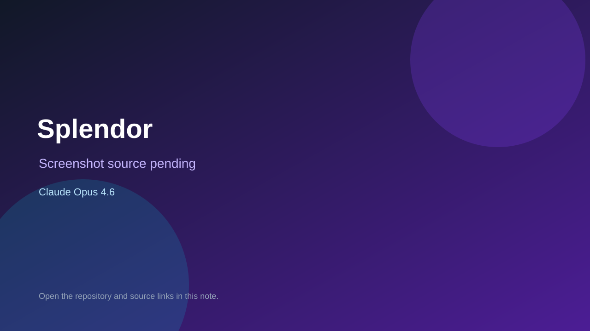

# Splendor

> Verified game note.

## At a glance

- **Score:** 8.0/10
- **Model:** Claude Opus 4.6
- **Technology:** HTML, JavaScript, Vite, Canvas, Godot 4.6, GDScript, Browser, Web export
- **Verified:** 2026-09-10
- **Repository:** [https://github.com/vi-o-al-ai/claude_playground](https://github.com/vi-o-al-ai/claude_playground)
- **Evidence:** [repository-level model evidence](https://github.com/vi-o-al-ai/claude_playground/commit/b240aa12f03808c451b61156a7c2fff7a32f7c2d)
- **Live demo:** [open demo](https://vi-o-al-ai.github.io/claude_playground/)

## Screenshots

No screenshot source is recorded yet. Keep the placeholder until a repository, awesome list, or creator source provides an image.

## Model attribution

Open the evidence link above. Evidence grade: **repository-level model evidence**.

## Source description

The repository README describes a browser-based arcade mostly written with Claude Code and provides a live GitHub Pages site. Repository structure contains six independent web-game packages and one Godot runner package, each with game metadata and source. Package metadata identifies the six web titles; arcade.json identifies Zombie Lane Runner. The repository history includes Opus-attributed game work, including a Godot runner feature commit and the stack reorganization commit. Count each listed game once. The Godot game is routed to the separate engine section even though it has a Web export.

### Gameplay source

- [https://github.com/vi-o-al-ai/claude_playground/tree/main/games/web/in-a-nutshell](https://github.com/vi-o-al-ai/claude_playground/tree/main/games/web/in-a-nutshell)
- [https://github.com/vi-o-al-ai/claude_playground/tree/main/games/web/solitaire](https://github.com/vi-o-al-ai/claude_playground/tree/main/games/web/solitaire)
- [https://github.com/vi-o-al-ai/claude_playground/tree/main/games/web/space-invaders](https://github.com/vi-o-al-ai/claude_playground/tree/main/games/web/space-invaders)
- [https://github.com/vi-o-al-ai/claude_playground/tree/main/games/web/splendor](https://github.com/vi-o-al-ai/claude_playground/tree/main/games/web/splendor)
- [https://github.com/vi-o-al-ai/claude_playground/tree/main/games/web/sudoku](https://github.com/vi-o-al-ai/claude_playground/tree/main/games/web/sudoku)
- [https://github.com/vi-o-al-ai/claude_playground/tree/main/games/web/tic-tac-toe](https://github.com/vi-o-al-ai/claude_playground/tree/main/games/web/tic-tac-toe)
- [https://github.com/vi-o-al-ai/claude_playground/tree/main/games/godot/runner](https://github.com/vi-o-al-ai/claude_playground/tree/main/games/godot/runner)
- [https://github.com/vi-o-al-ai/claude_playground/commit/b240aa12f03808c451b61156a7c2fff7a32f7c2d](https://github.com/vi-o-al-ai/claude_playground/commit/b240aa12f03808c451b61156a7c2fff7a32f7c2d)

## Verification notes

- **Status:** verified_source_and_live_site
- **Counted units:** 7
- **Discovery:** GitHub commit search for Co-Authored-By Claude Opus 4.6; https://github.com/vi-o-al-ai/claude_playground

[Back to the awesome list](../../README.md)
