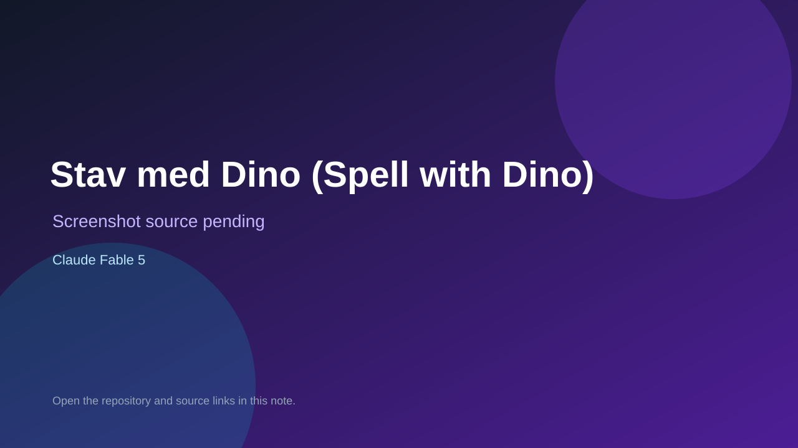

# Stav med Dino (Spell with Dino)

> Verified game note.

## At a glance

- **Score:** 8.8/10
- **Model:** Claude Fable 5
- **Technology:** TypeScript, React, Vite, Tailwind CSS, Vitest, PWA/offline, Browser
- **Verified:** 2026-09-10
- **Repository:** [https://github.com/MikkelAJ92/rolige-laerespil](https://github.com/MikkelAJ92/rolige-laerespil)
- **Evidence:** [direct model evidence](https://github.com/MikkelAJ92/rolige-laerespil/commit/38702beecf2e40158fe22da307fc329bf3711417)

## Screenshots

No screenshot source is recorded yet. Keep the placeholder until a repository, awesome list, or creator source provides an image.

## Model attribution

Open the evidence link above. Evidence grade: **direct model evidence**.

## Source description

The Danish README documents four games sharing a progression account: What Is the Time? reads an analog clock with adaptive difficulty; Set the Hands moves clock hands into place; Spell with Dino is a word-letter game with read-aloud support; and Alfred Cracks the Code is a Mastermind-style code-breaking game with draggable numbers and four difficulty levels. The source has separate Clock, WordGame and CodeGame components plus separate time, words and code rule modules; tests cover audio, hints, mastery, persistence, scenes, time, words and code. The cited commit adds the fourth game, its tested engine, scene system, persistence, board and wiring and contains exact Co-Authored-By: Claude Fable 5 trailers. Count the four independently playable game modes once each; exclude the shared owl, themes, levels and progression account.

### Gameplay source

- [https://github.com/MikkelAJ92/rolige-laerespil#readme](https://github.com/MikkelAJ92/rolige-laerespil#readme)
- [https://github.com/MikkelAJ92/rolige-laerespil/blob/main/src/components/Clock.tsx](https://github.com/MikkelAJ92/rolige-laerespil/blob/main/src/components/Clock.tsx)
- [https://github.com/MikkelAJ92/rolige-laerespil/blob/main/src/components/WordGame.tsx](https://github.com/MikkelAJ92/rolige-laerespil/blob/main/src/components/WordGame.tsx)
- [https://github.com/MikkelAJ92/rolige-laerespil/blob/main/src/components/CodeGame.tsx](https://github.com/MikkelAJ92/rolige-laerespil/blob/main/src/components/CodeGame.tsx)
- [https://github.com/MikkelAJ92/rolige-laerespil/blob/main/src/domain/time.ts](https://github.com/MikkelAJ92/rolige-laerespil/blob/main/src/domain/time.ts)
- [https://github.com/MikkelAJ92/rolige-laerespil/blob/main/src/domain/words.ts](https://github.com/MikkelAJ92/rolige-laerespil/blob/main/src/domain/words.ts)
- [https://github.com/MikkelAJ92/rolige-laerespil/blob/main/src/domain/code.ts](https://github.com/MikkelAJ92/rolige-laerespil/blob/main/src/domain/code.ts)
- [https://github.com/MikkelAJ92/rolige-laerespil/tree/main/tests](https://github.com/MikkelAJ92/rolige-laerespil/tree/main/tests)
- [https://github.com/MikkelAJ92/rolige-laerespil/commit/38702beecf2e40158fe22da307fc329bf3711417](https://github.com/MikkelAJ92/rolige-laerespil/commit/38702beecf2e40158fe22da307fc329bf3711417)

## Verification notes

- **Status:** verified_source
- **Counted units:** 4
- **Discovery:** GitHub commit search for Co-Authored-By Claude Fable game; https://github.com/MikkelAJ92/rolige-laerespil

[Back to the awesome list](../../README.md)
