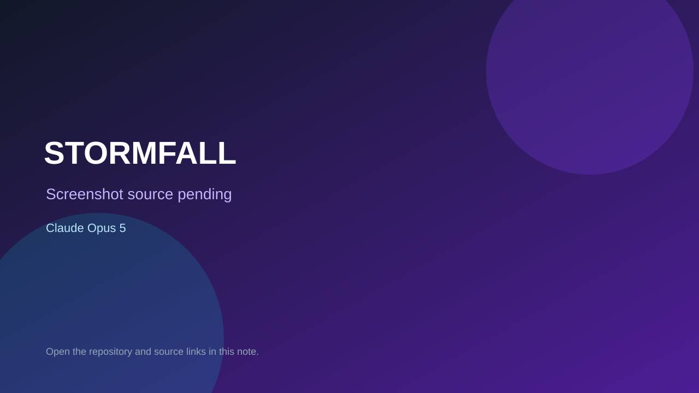

# STORMFALL

> Verified game note.

## At a glance

- **Score:** 9.2/10
- **Model:** Claude Opus 5
- **Technology:** Unreal Engine 5.8, Godot 4.7, C++, GDScript, Native desktop
- **Verified:** 2026-09-10
- **Repository:** [https://github.com/oh-ashen-one/Opus-5-Three-Games](https://github.com/oh-ashen-one/Opus-5-Three-Games)
- **Evidence:** [direct model evidence](https://github.com/oh-ashen-one/Opus-5-Three-Games/commit/5df172a9840ce634020779f00affc05eac4fe9af)

## Screenshots

No screenshot source is recorded yet. Keep the placeholder until a repository, awesome list, or creator source provides an image.

## Model attribution

Open the evidence link above. Evidence grade: **direct model evidence**.

## Source description

The repository README identifies three separate games: STORMFALL in Unreal Engine 5.8, STRIKE PROTOCOL in Godot 4.7, and TEACUP in Godot 4.7. Each directory has engine project files, gameplay source, scenes or build scripts, tests and a running guide. The commit series shows direct Claude Opus 5 attribution. Count the three distinct games, not the repository as one game.

### Gameplay source

- [https://github.com/oh-ashen-one/Opus-5-Three-Games/tree/main/01-stormfall-ue](https://github.com/oh-ashen-one/Opus-5-Three-Games/tree/main/01-stormfall-ue)
- [https://github.com/oh-ashen-one/Opus-5-Three-Games/tree/main/02-strike-godot](https://github.com/oh-ashen-one/Opus-5-Three-Games/tree/main/02-strike-godot)
- [https://github.com/oh-ashen-one/Opus-5-Three-Games/tree/main/03-teacup-godot](https://github.com/oh-ashen-one/Opus-5-Three-Games/tree/main/03-teacup-godot)
- [https://github.com/oh-ashen-one/Opus-5-Three-Games/commit/5df172a9840ce634020779f00affc05eac4fe9af](https://github.com/oh-ashen-one/Opus-5-Three-Games/commit/5df172a9840ce634020779f00affc05eac4fe9af)

## Verification notes

- **Status:** verified_source
- **Counted units:** 3
- **Discovery:** GitHub commit search for Unreal playable game Co-Authored-By Claude Opus; https://github.com/oh-ashen-one/Opus-5-Three-Games

[Back to the awesome list](../../README.md)
