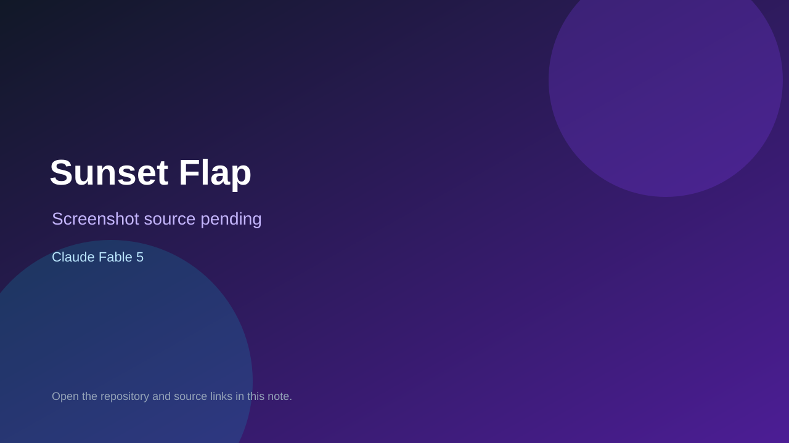

# Sunset Flap

> Verified game note.

## At a glance

- **Score:** 7.5/10
- **Model:** Claude Fable 5
- **Technology:** HTML, JavaScript, Three.js
- **Verified:** 2026-09-09
- **Repository:** [https://github.com/5kahoisaac/sunset-flap](https://github.com/5kahoisaac/sunset-flap)
- **Evidence:** [creator-reported model evidence](https://github.com/5kahoisaac/sunset-flap/blob/main/README.md)

## Screenshots

No screenshot source is recorded yet. Keep the placeholder until a repository, awesome list, or creator source provides an image.

## Model attribution

Open the evidence link above. Evidence grade: **creator-reported model evidence**.

## Source description

README and index.html contain a playable 3D Flappy Bird game with flight controls and obstacles; README names Claude Fable 5 and the prompt.

### Gameplay source

- [https://github.com/5kahoisaac/sunset-flap/blob/main/README.md](https://github.com/5kahoisaac/sunset-flap/blob/main/README.md)

## Verification notes

- **Status:** verified
- **Counted units:** 1
- **Discovery:** https://github.com/5kahoisaac/sunset-flap

[Back to the awesome list](../../README.md)
