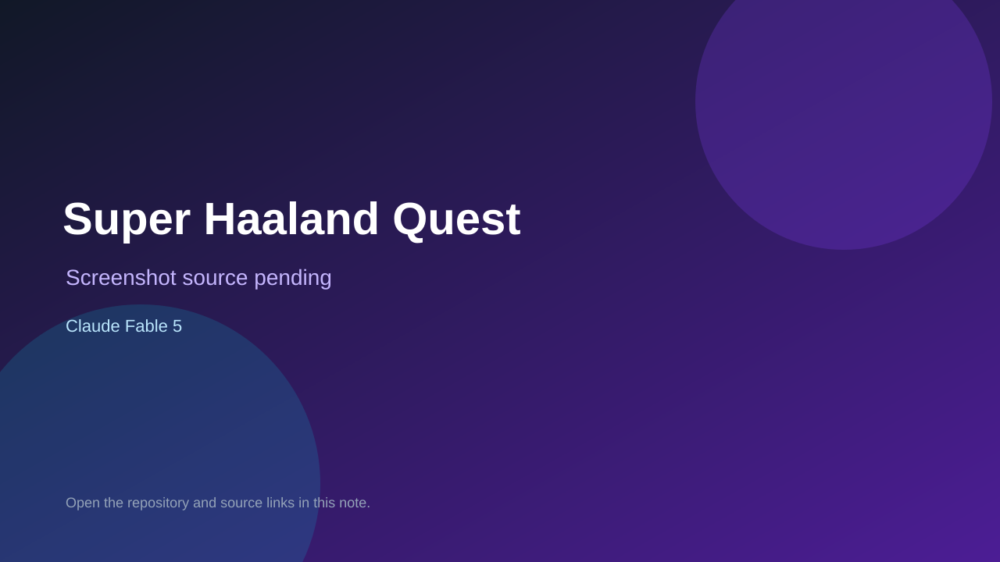

# Super Haaland Quest

> Verified game note.

## At a glance

- **Score:** 7.0/10
- **Model:** Claude Fable 5
- **Technology:** JavaScript, Canvas
- **Verified:** 2026-09-09
- **Repository:** [https://github.com/houssemeddinelassoued/haaland-quest-game](https://github.com/houssemeddinelassoued/haaland-quest-game)
- **Evidence:** [creator-reported model evidence](https://github.com/houssemeddinelassoued/haaland-quest-game)

## Screenshots

No screenshot source is recorded yet. Keep the placeholder until a repository, awesome list, or creator source provides an image.

## Model attribution

Open the evidence link above. Evidence grade: **creator-reported model evidence**.

## Source description

Repository description and JavaScript source contain a playable Super Mario-style platformer and identify Claude Fable 5 among the development models.

### Gameplay source

- [https://github.com/houssemeddinelassoued/haaland-quest-game](https://github.com/houssemeddinelassoued/haaland-quest-game)

## Verification notes

- **Status:** verified
- **Counted units:** 1
- **Discovery:** https://github.com/houssemeddinelassoued/haaland-quest-game

[Back to the awesome list](../../README.md)
