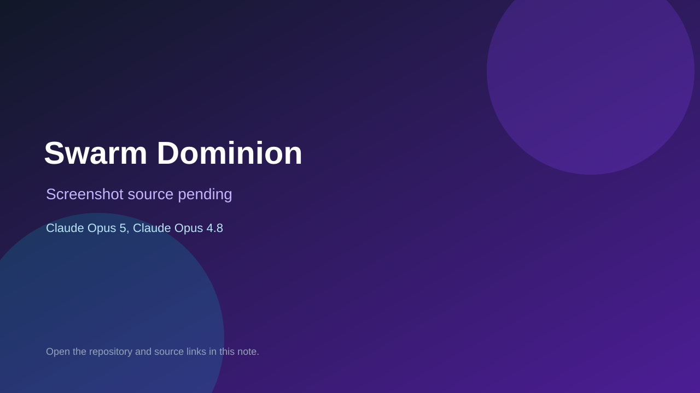

# Swarm Dominion

> Verified game note.

## At a glance

- **Score:** 8.7/10
- **Model:** Claude Opus 5, Claude Opus 4.8
- **Technology:** Godot 4.3, GDScript, Native desktop, 2D real-time strategy, Unit AI, GUT tests
- **Verified:** 2026-09-10
- **Repository:** [https://github.com/johnburbridge/swarm-dominion](https://github.com/johnburbridge/swarm-dominion)
- **Evidence:** [direct model evidence](https://github.com/johnburbridge/swarm-dominion/commit/940aa6a0e83af2743e971513a8de16309cf3e110)

## Screenshots

No screenshot source is recorded yet. Keep the placeholder until a repository, awesome list, or creator source provides an image.

## Model attribution

Open the evidence link above. Evidence grade: **direct model evidence**.

## Source description

The README provides a Godot project with a main scene, open-source 5–15 minute RTS design, unit progression, biomass resource gathering, control points, fog of war, selection, group commands, attack-move and unit combat. The repository contains Godot scenes for the main game, Mother and Drone units, biomass nodes, HUD and health bars, GDScript unit/resource systems, map data and a large GUT test suite. The inspected history contains exact Claude Opus 5 and 4.8 trailers on commands, unit behavior, rally points, controls and gameplay systems. Multiplayer and later RTS features are marked roadmap items; count the current playable RTS prototype once.

### Gameplay source

- [https://github.com/johnburbridge/swarm-dominion/blob/main/README.md](https://github.com/johnburbridge/swarm-dominion/blob/main/README.md)
- [https://github.com/johnburbridge/swarm-dominion/blob/main/project.godot](https://github.com/johnburbridge/swarm-dominion/blob/main/project.godot)
- [https://github.com/johnburbridge/swarm-dominion/blob/main/scenes/main/main.tscn](https://github.com/johnburbridge/swarm-dominion/blob/main/scenes/main/main.tscn)
- [https://github.com/johnburbridge/swarm-dominion/blob/main/scripts/main.gd](https://github.com/johnburbridge/swarm-dominion/blob/main/scripts/main.gd)
- [https://github.com/johnburbridge/swarm-dominion/tree/main/scripts/units](https://github.com/johnburbridge/swarm-dominion/tree/main/scripts/units)
- [https://github.com/johnburbridge/swarm-dominion/tree/main/scripts/resources](https://github.com/johnburbridge/swarm-dominion/tree/main/scripts/resources)
- [https://github.com/johnburbridge/swarm-dominion/tree/main/tests](https://github.com/johnburbridge/swarm-dominion/tree/main/tests)
- [https://github.com/johnburbridge/swarm-dominion/commit/940aa6a0e83af2743e971513a8de16309cf3e110](https://github.com/johnburbridge/swarm-dominion/commit/940aa6a0e83af2743e971513a8de16309cf3e110)

## Verification notes

- **Status:** verified_source
- **Counted units:** 1
- **Discovery:** GitHub code search for Godot game Co-Authored-By Claude Opus 4.8; https://github.com/johnburbridge/swarm-dominion

[Back to the awesome list](../../README.md)
