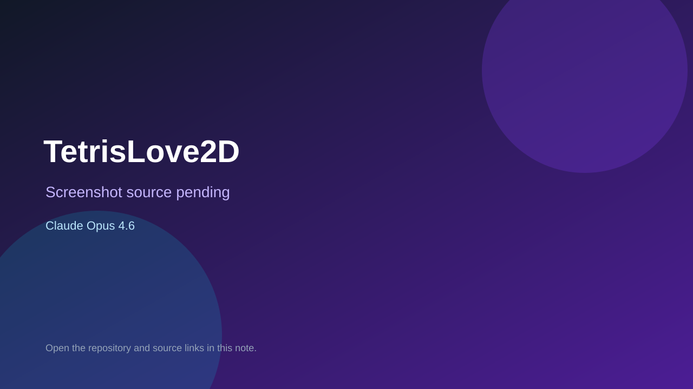

# TetrisLove2D

> Verified game note.

## At a glance

- **Score:** 8.7/10
- **Model:** Claude Opus 4.6
- **Technology:** LÖVE 2D, Lua, Native desktop
- **Verified:** 2026-09-10
- **Repository:** [https://github.com/TiagoBonamigo/TetrisLove2D](https://github.com/TiagoBonamigo/TetrisLove2D)
- **Evidence:** [direct model evidence](https://github.com/TiagoBonamigo/TetrisLove2D/commit/254b26e2ea1befca98801e6d3225f87ba22f9678)

## Screenshots

No screenshot source is recorded yet. Keep the placeholder until a repository, awesome list, or creator source provides an image.

## Model attribution

Open the evidence link above. Evidence grade: **direct model evidence**.

## Source description

The README describes an NES-faithful Tetris clone with 60 Hz timing, rotation system, DAS input, gravity curve, scoring and palette cycling. Source contains board, piece, game state, input, renderer, scoring, audio and title/playing states. The cited commit shows a direct Claude Opus 4.6 trailer.

### Gameplay source

- [https://github.com/TiagoBonamigo/TetrisLove2D/blob/master/README.md](https://github.com/TiagoBonamigo/TetrisLove2D/blob/master/README.md)
- [https://github.com/TiagoBonamigo/TetrisLove2D/blob/master/src/game.lua](https://github.com/TiagoBonamigo/TetrisLove2D/blob/master/src/game.lua)
- [https://github.com/TiagoBonamigo/TetrisLove2D/blob/master/src/board.lua](https://github.com/TiagoBonamigo/TetrisLove2D/blob/master/src/board.lua)
- [https://github.com/TiagoBonamigo/TetrisLove2D/blob/master/src/scoring.lua](https://github.com/TiagoBonamigo/TetrisLove2D/blob/master/src/scoring.lua)
- [https://github.com/TiagoBonamigo/TetrisLove2D/commit/254b26e2ea1befca98801e6d3225f87ba22f9678](https://github.com/TiagoBonamigo/TetrisLove2D/commit/254b26e2ea1befca98801e6d3225f87ba22f9678)

## Verification notes

- **Status:** verified_source
- **Counted units:** 1
- **Discovery:** GitHub commit search for Love2D game Co-Authored-By Claude Opus; https://github.com/TiagoBonamigo/TetrisLove2D

[Back to the awesome list](../../README.md)
