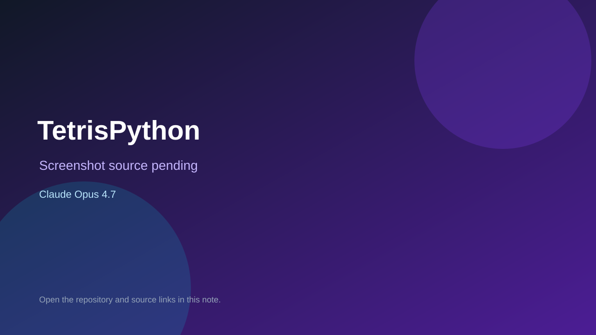

# TetrisPython

> Verified game note.

## At a glance

- **Score:** 8.0/10
- **Model:** Claude Opus 4.7
- **Technology:** Pygame, Python, Native desktop
- **Verified:** 2026-09-10
- **Repository:** [https://github.com/fmam0126/TetrisPython](https://github.com/fmam0126/TetrisPython)
- **Evidence:** [direct model evidence](https://github.com/fmam0126/TetrisPython/commit/1248a9763cccb5780d2d44879b982050800bac6d)

## Screenshots

No screenshot source is recorded yet. Keep the placeholder until a repository, awesome list, or creator source provides an image.

## Model attribution

Open the evidence link above. Evidence grade: **direct model evidence**.

## Source description

The repository contains a complete Pygame Tetris implementation with a 60 FPS loop, seven tetromino shapes, SRS wall kicks, hold/next pieces, line clearing, level/score state, pause and game-over flow in tetris.py. The cited commit adds the game and includes a direct Claude Opus 4.7 trailer. The default branch is master, and the commit-pinned source link is verified.

### Gameplay source

- [https://github.com/fmam0126/TetrisPython/blob/1248a9763cccb5780d2d44879b982050800bac6d/tetris.py](https://github.com/fmam0126/TetrisPython/blob/1248a9763cccb5780d2d44879b982050800bac6d/tetris.py)
- [https://github.com/fmam0126/TetrisPython/commit/1248a9763cccb5780d2d44879b982050800bac6d](https://github.com/fmam0126/TetrisPython/commit/1248a9763cccb5780d2d44879b982050800bac6d)

## Verification notes

- **Status:** verified_source
- **Counted units:** 1
- **Discovery:** GitHub commit search for pygame game Co-Authored-By Claude Opus; https://github.com/fmam0126/TetrisPython

[Back to the awesome list](../../README.md)
