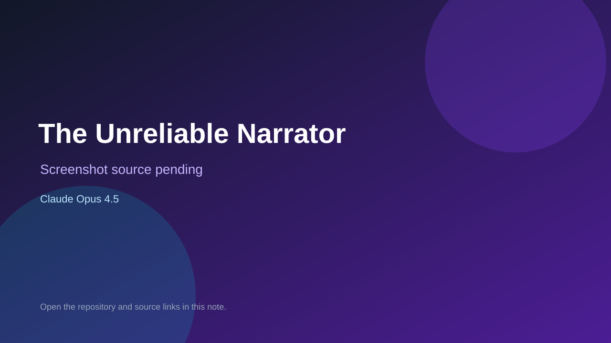

# The Unreliable Narrator

> Verified game note.

## At a glance

- **Score:** 8.8/10
- **Model:** Claude Opus 4.5
- **Technology:** libGDX, Java, Native desktop
- **Verified:** 2026-09-10
- **Repository:** [https://github.com/DevStreamLogica/The-Unreliable-Narrator](https://github.com/DevStreamLogica/The-Unreliable-Narrator)
- **Evidence:** [direct model evidence](https://github.com/DevStreamLogica/The-Unreliable-Narrator/commit/5419bf6107e4855c31c311b4aa8bd143a991e4ff)

## Screenshots

No screenshot source is recorded yet. Keep the placeholder until a repository, awesome list, or creator source provides an image.

## Model attribution

Open the evidence link above. Evidence grade: **direct model evidence**.

## Source description

The initial commit is titled The Unreliable Narrator - 2D murder mystery game and describes a LibGDX point-and-click detective game with complete gameplay. Source includes rooms/navigation, suspects, evidence, contradictions, tape content, examination/interview/narrator systems, achievements, save/load, game screen and desktop launcher. The commit page shows a direct Claude Opus 4.5 trailer.

### Gameplay source

- [https://github.com/DevStreamLogica/The-Unreliable-Narrator/tree/main/core/src/main/java/com/dsa/game](https://github.com/DevStreamLogica/The-Unreliable-Narrator/tree/main/core/src/main/java/com/dsa/game)
- [https://github.com/DevStreamLogica/The-Unreliable-Narrator/blob/main/core/src/main/java/com/dsa/game/screens/GameScreen.java](https://github.com/DevStreamLogica/The-Unreliable-Narrator/blob/main/core/src/main/java/com/dsa/game/screens/GameScreen.java)
- [https://github.com/DevStreamLogica/The-Unreliable-Narrator/commit/5419bf6107e4855c31c311b4aa8bd143a991e4ff](https://github.com/DevStreamLogica/The-Unreliable-Narrator/commit/5419bf6107e4855c31c311b4aa8bd143a991e4ff)

## Verification notes

- **Status:** verified_source
- **Counted units:** 1
- **Discovery:** GitHub commit search for LibGDX game Co-Authored-By Claude Opus; https://github.com/DevStreamLogica/The-Unreliable-Narrator

[Back to the awesome list](../../README.md)
