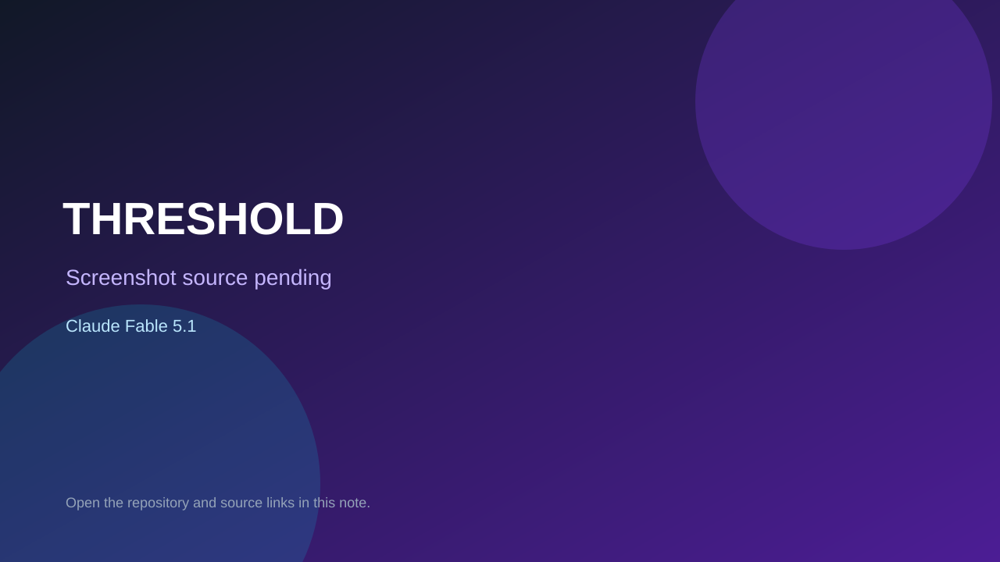

# THRESHOLD

> Verified game note.

## At a glance

- **Score:** 7.5/10
- **Model:** Claude Fable 5.1
- **Technology:** WebGL2, JavaScript, Web Audio API
- **Verified:** 2026-09-09
- **Repository:** [https://github.com/CantankerousPotatomancer/threshold-fable-5-1](https://github.com/CantankerousPotatomancer/threshold-fable-5-1)
- **Evidence:** [creator-reported model evidence](https://github.com/CantankerousPotatomancer/threshold-fable-5-1)

## Screenshots

No screenshot source is recorded yet. Keep the placeholder until a repository, awesome list, or creator source provides an image.

## Model attribution

Open the evidence link above. Evidence grade: **creator-reported model evidence**.

## Source description

Playable 3D exploration game with keys, keeps, beasts, combat, item interactions, win route, tests, and explicit Fable 5.1 attribution.

### Gameplay source

- [https://github.com/CantankerousPotatomancer/threshold-fable-5-1](https://github.com/CantankerousPotatomancer/threshold-fable-5-1)

## Verification notes

- **Status:** verified
- **Counted units:** 1
- **Discovery:** https://github.com/CantankerousPotatomancer/threshold-fable-5-1

[Back to the awesome list](../../README.md)
