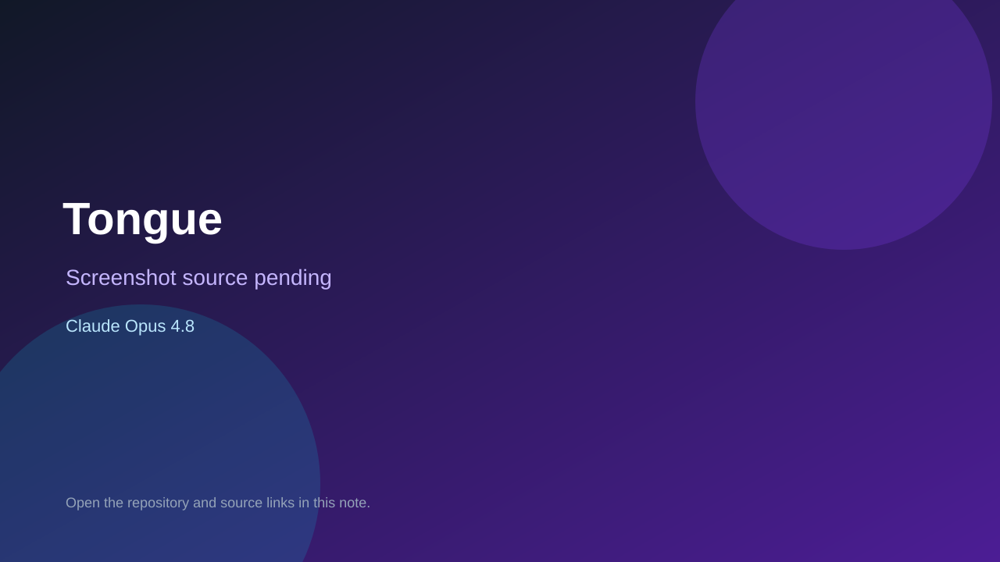

# Tongue

> Verified game note.

## At a glance

- **Score:** 8.0/10
- **Model:** Claude Opus 4.8
- **Technology:** Godot, GDScript, Native desktop
- **Verified:** 2026-09-10
- **Repository:** [https://github.com/asg86260/Tongue](https://github.com/asg86260/Tongue)
- **Evidence:** [direct model evidence](https://github.com/asg86260/Tongue/commit/83dc1afa3d6f762e38953feddde9d1c8618e9599)

## Screenshots

No screenshot source is recorded yet. Keep the placeholder until a repository, awesome list, or creator source provides an image.

## Model attribution

Open the evidence link above. Evidence grade: **direct model evidence**.

## Source description

The README identifies Tongue as a physics tongue-swing game and gives Godot 4.7 run instructions. The repository contains project.godot, Main.tscn and Game.gd with grapple, swing, leap, movement, jump and reset controls. The initial commit includes a direct Claude Opus 4.8 trailer.

### Gameplay source

- [https://github.com/asg86260/Tongue/blob/83dc1afa3d6f762e38953feddde9d1c8618e9599/project.godot](https://github.com/asg86260/Tongue/blob/83dc1afa3d6f762e38953feddde9d1c8618e9599/project.godot)
- [https://github.com/asg86260/Tongue/blob/83dc1afa3d6f762e38953feddde9d1c8618e9599/Game.gd](https://github.com/asg86260/Tongue/blob/83dc1afa3d6f762e38953feddde9d1c8618e9599/Game.gd)
- [https://github.com/asg86260/Tongue/blob/83dc1afa3d6f762e38953feddde9d1c8618e9599/Main.tscn](https://github.com/asg86260/Tongue/blob/83dc1afa3d6f762e38953feddde9d1c8618e9599/Main.tscn)
- [https://github.com/asg86260/Tongue/commit/83dc1afa3d6f762e38953feddde9d1c8618e9599](https://github.com/asg86260/Tongue/commit/83dc1afa3d6f762e38953feddde9d1c8618e9599)

## Verification notes

- **Status:** verified_source
- **Counted units:** 1
- **Discovery:** GitHub commit search for Godot game Co-Authored-By Claude Opus; https://github.com/asg86260/Tongue

[Back to the awesome list](../../README.md)
