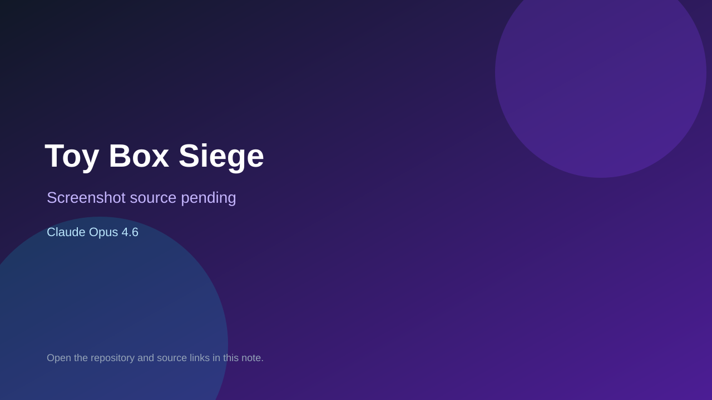

# Toy Box Siege

> Verified game note.

## At a glance

- **Score:** 8.7/10
- **Model:** Claude Opus 4.6
- **Technology:** TypeScript, Phaser, Vite, Browser
- **Verified:** 2026-09-10
- **Repository:** [https://github.com/Jaxsbr/toy-box-siege](https://github.com/Jaxsbr/toy-box-siege)
- **Evidence:** [direct model evidence](https://github.com/Jaxsbr/toy-box-siege/commit/dbe337ca4392b330f74fa1d0a9b05636e84c4c1d)

## Screenshots

No screenshot source is recorded yet. Keep the placeholder until a repository, awesome list, or creator source provides an image.

## Model attribution

Open the evidence link above. Evidence grade: **direct model evidence**.

## Source description

The README identifies a bedroom-themed tower-defense game. package.json contains a Phaser/Vite browser runtime, and the repository history contains game implementation commits for progression, enemies, levels, weapons, bosses, visual effects and playtest tuning. The cited game-juice commit includes repeated Co-Authored-By: Claude Opus 4.6 trailers. Count it as source-verified because no stable live URL was found.

### Gameplay source

- [https://github.com/Jaxsbr/toy-box-siege/tree/main/src](https://github.com/Jaxsbr/toy-box-siege/tree/main/src)
- [https://github.com/Jaxsbr/toy-box-siege/commit/dbe337ca4392b330f74fa1d0a9b05636e84c4c1d](https://github.com/Jaxsbr/toy-box-siege/commit/dbe337ca4392b330f74fa1d0a9b05636e84c4c1d)

## Verification notes

- **Status:** verified_source
- **Counted units:** 1
- **Discovery:** GitHub commit search for Co-Authored-By Claude Opus 4.6; https://github.com/Jaxsbr/toy-box-siege

[Back to the awesome list](../../README.md)
