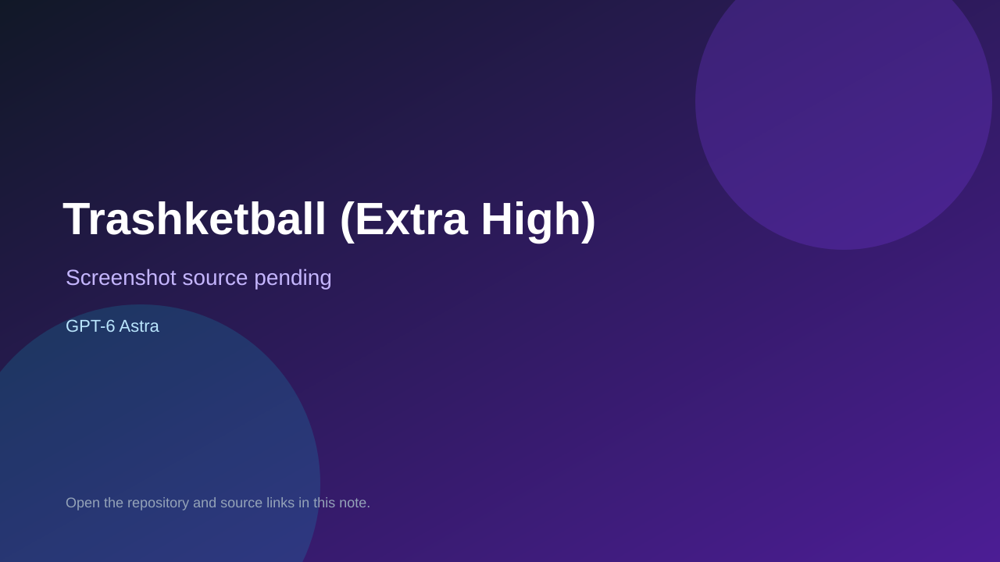

# Trashketball (Extra High)

> Verified game note.

## At a glance

- **Score:** 7.5/10
- **Model:** GPT-6 Astra
- **Technology:** React, TypeScript, Three.js, WebGL, Vite
- **Verified:** 2026-09-09
- **Repository:** [https://github.com/swathidbhat/gpt6-astra-extrahigh-codex-trashketball](https://github.com/swathidbhat/gpt6-astra-extrahigh-codex-trashketball)
- **Evidence:** [creator-reported model evidence](https://github.com/swathidbhat/gpt6-astra-extrahigh-codex-trashketball)

## Screenshots

No screenshot source is recorded yet. Keep the placeholder until a repository, awesome list, or creator source provides an image.

## Model attribution

Open the evidence link above. Evidence grade: **creator-reported model evidence**.

## Source description

The repository name identifies a GPT-6 Astra Extra High Codex build. The repository contains a Next/Vite app, game components, physics libraries, tests and public runtime assets for the Trashketball paper-toss game.

### Gameplay source

- [https://github.com/swathidbhat/gpt6-astra-extrahigh-codex-trashketball](https://github.com/swathidbhat/gpt6-astra-extrahigh-codex-trashketball)

## Verification notes

- **Status:** verified
- **Counted units:** 1
- **Discovery:** https://github.com/swathidbhat/gpt6-astra-extrahigh-codex-trashketball

[Back to the awesome list](../../README.md)
