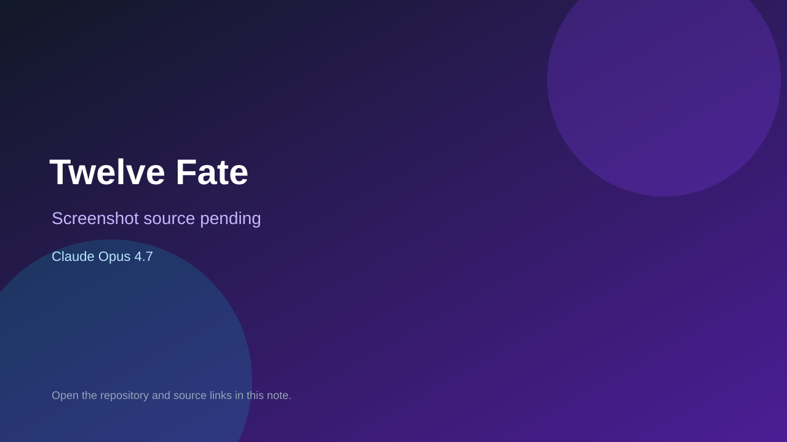

# Twelve Fate

> Verified game note.

## At a glance

- **Score:** 8.5/10
- **Model:** Claude Opus 4.7
- **Technology:** Cocos Creator 3.8.8, TypeScript, Native mobile
- **Verified:** 2026-09-10
- **Repository:** [https://github.com/windy341524-glitch/twelve-fate-cocos](https://github.com/windy341524-glitch/twelve-fate-cocos)
- **Evidence:** [direct model evidence](https://github.com/windy341524-glitch/twelve-fate-cocos/commit/61db09f167e5ad18567c33235b29530c53f4e53e)

## Screenshots

No screenshot source is recorded yet. Keep the placeholder until a repository, awesome list, or creator source provides an image.

## Model attribution

Open the evidence link above. Evidence grade: **direct model evidence**.

## Source description

The initial commit describes a Cocos Creator 3.8.8 WeChat mini game with event flow, resource management, oracle/diary AI generation, achievements and multiple endings. Source includes a scene, game bootstrap/state, event/choice/diary/oracle/resource/ending systems and UI views. The commit page shows a direct Claude Opus 4.7 trailer.

### Gameplay source

- [https://github.com/windy341524-glitch/twelve-fate-cocos/blob/main/assets/scene.scene](https://github.com/windy341524-glitch/twelve-fate-cocos/blob/main/assets/scene.scene)
- [https://github.com/windy341524-glitch/twelve-fate-cocos/tree/main/assets/scripts](https://github.com/windy341524-glitch/twelve-fate-cocos/tree/main/assets/scripts)
- [https://github.com/windy341524-glitch/twelve-fate-cocos/commit/61db09f167e5ad18567c33235b29530c53f4e53e](https://github.com/windy341524-glitch/twelve-fate-cocos/commit/61db09f167e5ad18567c33235b29530c53f4e53e)

## Verification notes

- **Status:** verified_source
- **Counted units:** 1
- **Discovery:** GitHub commit search for Cocos game Co-Authored-By Claude Opus; https://github.com/windy341524-glitch/twelve-fate-cocos

[Back to the awesome list](../../README.md)
