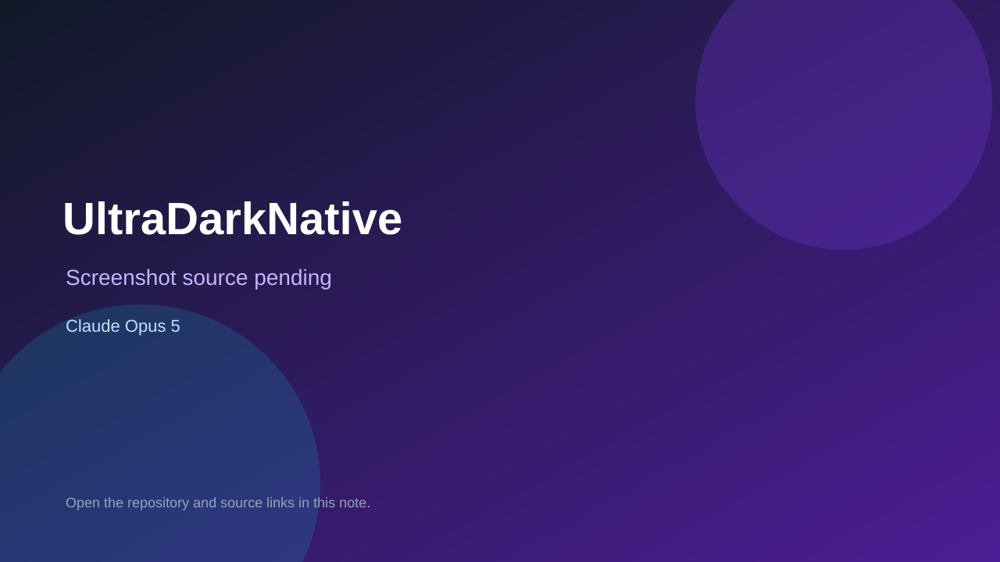

# UltraDarkNative

> Verified game note.

## At a glance

- **Score:** 8.4/10
- **Model:** Claude Opus 5
- **Technology:** MonoGame, C#, Native desktop
- **Verified:** 2026-09-10
- **Repository:** [https://github.com/3disturbed/UltraDarkNative](https://github.com/3disturbed/UltraDarkNative)
- **Evidence:** [direct model evidence](https://github.com/3disturbed/UltraDarkNative/commit/9b210c44bac6053f5d1c6d5828d3766f6557f581)

## Screenshots

No screenshot source is recorded yet. Keep the placeholder until a repository, awesome list, or creator source provides an image.

## Model attribution

Open the evidence link above. Evidence grade: **direct model evidence**.

## Source description

The cited commit is titled MonoGame client with vector renderer, prediction, input and a playable listen server. Source includes client world/game client, demo pilot, desktop input, game actions, arena renderer/view, glow/particle layers, vector canvas and desktop game host. The commit page shows a direct Claude Opus 5 trailer.

### Gameplay source

- [https://github.com/3disturbed/UltraDarkNative/blob/main/src/Game.Client/GameClient.cs](https://github.com/3disturbed/UltraDarkNative/blob/main/src/Game.Client/GameClient.cs)
- [https://github.com/3disturbed/UltraDarkNative/tree/main/src/Game.Client/Rendering](https://github.com/3disturbed/UltraDarkNative/tree/main/src/Game.Client/Rendering)
- [https://github.com/3disturbed/UltraDarkNative/blob/main/src/Game.Desktop/UltraDarkGame.cs](https://github.com/3disturbed/UltraDarkNative/blob/main/src/Game.Desktop/UltraDarkGame.cs)
- [https://github.com/3disturbed/UltraDarkNative/commit/9b210c44bac6053f5d1c6d5828d3766f6557f581](https://github.com/3disturbed/UltraDarkNative/commit/9b210c44bac6053f5d1c6d5828d3766f6557f581)

## Verification notes

- **Status:** verified_source
- **Counted units:** 1
- **Discovery:** GitHub commit search for MonoGame game Co-Authored-By Claude Opus; https://github.com/3disturbed/UltraDarkNative

[Back to the awesome list](../../README.md)
