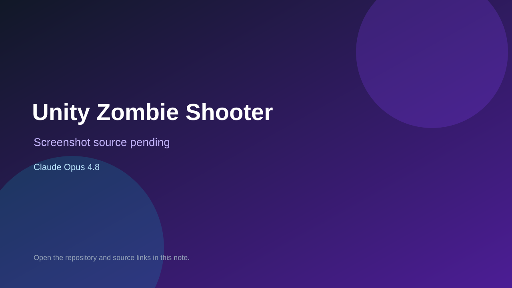

# Unity Zombie Shooter

> Verified game note.

## At a glance

- **Score:** 8.4/10
- **Model:** Claude Opus 4.8
- **Technology:** Unity, C#, Universal Render Pipeline, Native
- **Verified:** 2026-09-10
- **Repository:** [https://github.com/danius123q5-creator/danich_game](https://github.com/danius123q5-creator/danich_game)
- **Evidence:** [direct model evidence](https://github.com/danius123q5-creator/danich_game/commit/15a5d8a466c51cf6c5c4e209c6234b552a8aceb6)

## Screenshots

No screenshot source is recorded yet. Keep the placeholder until a repository, awesome list, or creator source provides an image.

## Model attribution

Open the evidence link above. Evidence grade: **direct model evidence**.

## Source description

The repository is a Unity URP project with a SampleScene, player controller, zombie AI, weapons and combat systems, grenades, rockets, mines, artillery, air strikes, buildables, vehicles, LAN management and endgame cinematic scripts. The initial commit is titled Unity zombie shooter game source and carries a direct Co-Authored-By: Claude Opus 4.8 trailer.

### Gameplay source

- [https://github.com/danius123q5-creator/danich_game/blob/main/Assets/Scenes/SampleScene.unity](https://github.com/danius123q5-creator/danich_game/blob/main/Assets/Scenes/SampleScene.unity)
- [https://github.com/danius123q5-creator/danich_game/tree/main/Assets/Scripts](https://github.com/danius123q5-creator/danich_game/tree/main/Assets/Scripts)
- [https://github.com/danius123q5-creator/danich_game/commit/15a5d8a466c51cf6c5c4e209c6234b552a8aceb6](https://github.com/danius123q5-creator/danich_game/commit/15a5d8a466c51cf6c5c4e209c6234b552a8aceb6)

## Verification notes

- **Status:** verified_source
- **Counted units:** 1
- **Discovery:** GitHub commit search for Unity game Co-Authored-By Claude Opus; https://github.com/danius123q5-creator/danich_game

[Back to the awesome list](../../README.md)
