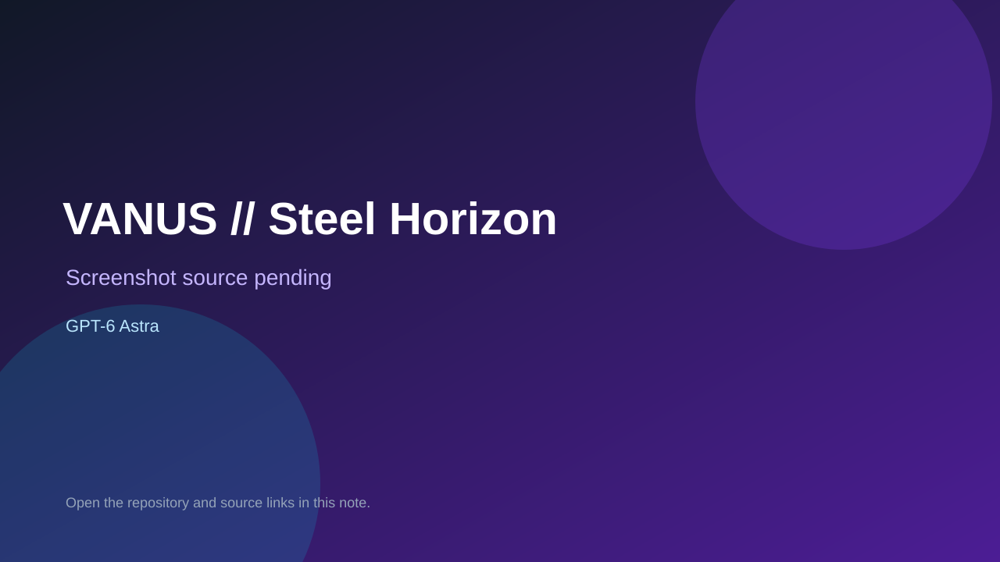

# VANUS // Steel Horizon

> Verified game note.

## At a glance

- **Score:** 8.3/10
- **Model:** GPT-6 Astra
- **Technology:** C++20, SDL3, OpenGL, GLM, Dear ImGui, Native desktop
- **Verified:** 2026-09-10
- **Repository:** [https://github.com/berlinbrown/vanus-toy-sim-gpt](https://github.com/berlinbrown/vanus-toy-sim-gpt)
- **Evidence:** [direct model evidence](https://github.com/berlinbrown/vanus-toy-sim-gpt#vanus--steel-horizon)

## Screenshots

No screenshot source is recorded yet. Keep the placeholder until a repository, awesome list, or creator source provides an image.

## Model attribution

Open the evidence link above. Evidence grade: **direct model evidence**.

## Source description

The README explicitly identifies VANUS // Steel Horizon as built with GPT6 Astra. It documents a playable C++20 mech-combat sandbox with third-person movement, mouse aiming, pulse weapons, 18 enemy bots, score, armor, radar, learned pursuit policies, restart and pause controls. The repository contains the SDL3/OpenGL game source, CMake build, native run instructions, deterministic autoplay screenshot mode and tests for collision, training, combat invariants and restart. Classify it under Non-Browser Engines.

### Gameplay source

- [https://github.com/berlinbrown/vanus-toy-sim-gpt/tree/main/vanus-toy-sim-core](https://github.com/berlinbrown/vanus-toy-sim-gpt/tree/main/vanus-toy-sim-core)
- [https://github.com/berlinbrown/vanus-toy-sim-gpt#vanus--steel-horizon](https://github.com/berlinbrown/vanus-toy-sim-gpt#vanus--steel-horizon)

## Verification notes

- **Status:** verified_source_build_instructions
- **Counted units:** 1
- **Discovery:** https://api.github.com/search/repositories?q=%22GPT6+Astra%22+game+in%3Areadme; https://github.com/berlinbrown/vanus-toy-sim-gpt

[Back to the awesome list](../../README.md)
