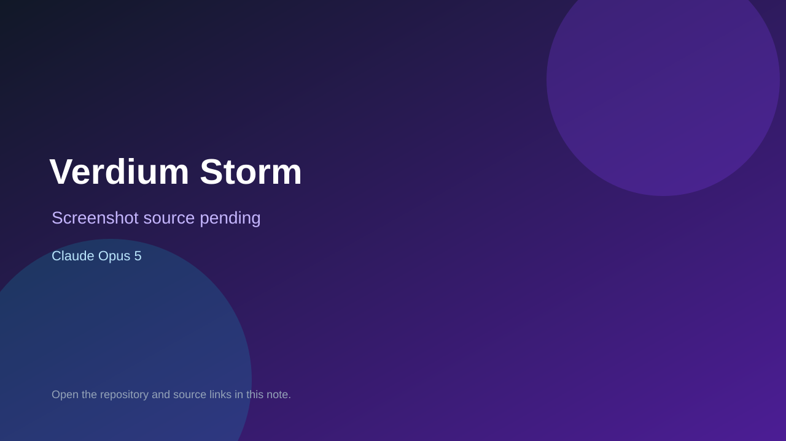

# Verdium Storm

> Verified game note.

## At a glance

- **Score:** 7.0/10
- **Model:** Claude Opus 5
- **Technology:** Three.js, TypeScript, Vite
- **Verified:** 2026-09-09
- **Repository:** [https://github.com/jimskin03/Verdium-Storm](https://github.com/jimskin03/Verdium-Storm)
- **Evidence:** [directory-method model evidence](https://github.com/jimskin03/Verdium-Storm)

## Screenshots

No screenshot source is recorded yet. Keep the placeholder until a repository, awesome list, or creator source provides an image.

## Model attribution

Open the evidence link above. Evidence grade: **directory-method model evidence**.

## Source description

Playable real-time strategy browser game; README includes a Gauntlet-style build prompt and credits Matt Shumer.

### Gameplay source

- [https://github.com/jimskin03/Verdium-Storm](https://github.com/jimskin03/Verdium-Storm)

## Verification notes

- **Status:** verified
- **Counted units:** 1
- **Discovery:** https://github.com/jimskin03/Verdium-Storm

[Back to the awesome list](../../README.md)
