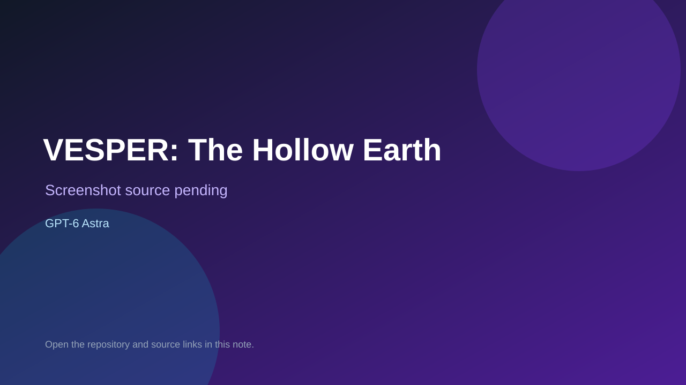

# VESPER: The Hollow Earth

> Verified game note.

## At a glance

- **Score:** 8.5/10
- **Model:** GPT-6 Astra
- **Technology:** Three.js, Vite, JavaScript, WebGL2, Web Audio API
- **Verified:** 2026-09-09
- **Repository:** [https://github.com/EiNSTeiN-/astra-tomb-raider-test](https://github.com/EiNSTeiN-/astra-tomb-raider-test)
- **Evidence:** [inferred model evidence](https://github.com/EiNSTeiN-/astra-tomb-raider-test/blob/main/README.md)

## Screenshots

No screenshot source is recorded yet. Keep the placeholder until a repository, awesome list, or creator source provides an image.

## Model attribution

Open the evidence link above. Evidence grade: **inferred model evidence**.

## Source description

README contains a playable eight-chapter browser adventure with movement, combat, puzzles, traversal, saves, controls, tests, and a local build. The Astra attribution is inferred from the repository identity and same-day GH Archive pushes; the README does not directly name GPT-6 Astra.

### Gameplay source

- [https://github.com/EiNSTeiN-/astra-tomb-raider-test/blob/main/README.md](https://github.com/EiNSTeiN-/astra-tomb-raider-test/blob/main/README.md)

## Verification notes

- **Status:** verified
- **Counted units:** 1
- **Discovery:** https://github.com/EiNSTeiN-/astra-tomb-raider-test; https://data.gharchive.org/2026-09-09-6.json.gz

[Back to the awesome list](../../README.md)
