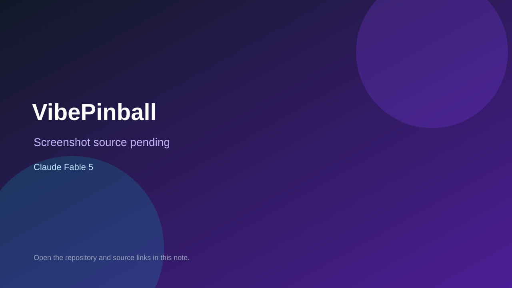

# VibePinball

> Verified game note.

## At a glance

- **Score:** 6.5/10
- **Model:** Claude Fable 5
- **Technology:** TypeScript, Canvas
- **Verified:** 2026-09-09
- **Repository:** [https://github.com/Randroids-Dojo/VibePinball](https://github.com/Randroids-Dojo/VibePinball)
- **Evidence:** [creator-reported model evidence](https://github.com/Randroids-Dojo/VibePinball)

## Screenshots

No screenshot source is recorded yet. Keep the placeholder until a repository, awesome list, or creator source provides an image.

## Model attribution

Open the evidence link above. Evidence grade: **creator-reported model evidence**.

## Source description

Repository source contains a playable pinball game; its description states it was built with Claude Fable 5 during a stream.

### Gameplay source

- [https://github.com/Randroids-Dojo/VibePinball](https://github.com/Randroids-Dojo/VibePinball)

## Verification notes

- **Status:** verified
- **Counted units:** 1
- **Discovery:** https://github.com/Randroids-Dojo/VibePinball

[Back to the awesome list](../../README.md)
