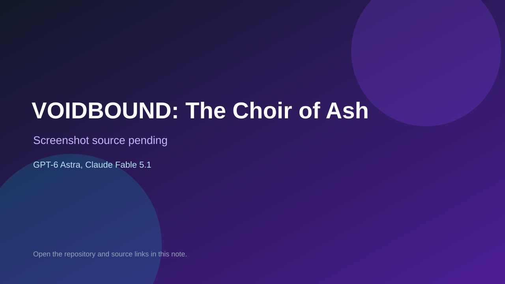

# VOIDBOUND: The Choir of Ash

> Verified game note.

## At a glance

- **Score:** 8.5/10
- **Model:** GPT-6 Astra, Claude Fable 5.1
- **Technology:** Three.js, WebGL2, GLSL, JavaScript, Web Audio, Browser
- **Verified:** 2026-09-09
- **Repository:** [https://github.com/alesha-pro/bench-portal](https://github.com/alesha-pro/bench-portal)
- **Evidence:** [creator-reported model evidence](https://github.com/alesha-pro/bench-portal#readme)

## Screenshots

No screenshot source is recorded yet. Keep the placeholder until a repository, awesome list, or creator source provides an image.

## Model attribution

Open the evidence link above. Evidence grade: **creator-reported model evidence**.

## Source description

The repository is a static portal that also contains self-contained game source, not a catalog-only link list. Its tree contains separate index.html and game.json files for VOIDRUNNER, VOIDBOUND and Onslaught. The game metadata identifies the Astra or Fable build, and the curated Astra source links the creator posts and exact game directories. Browser verification loaded and started all three public demos: VOIDRUNNER reached lap 01 with hull, weapons and controls HUD; VOIDBOUND reached Wave 01 with health, abilities and ten enemies remaining; Onslaught reached its FPS HUD with weapons, ammunition and deployment state. The non-game RIG showcase folders were excluded.

### Gameplay source

- [https://github.com/alesha-pro/bench-portal/tree/main/games/voidrunner-astra](https://github.com/alesha-pro/bench-portal/tree/main/games/voidrunner-astra)
- [https://github.com/alesha-pro/bench-portal/tree/main/games/voidbound-choir-of-ash](https://github.com/alesha-pro/bench-portal/tree/main/games/voidbound-choir-of-ash)
- [https://github.com/alesha-pro/bench-portal/tree/main/games/onslaught-fable-5.1](https://github.com/alesha-pro/bench-portal/tree/main/games/onslaught-fable-5.1)
- [https://github.com/alesha-pro/bench-portal#readme](https://github.com/alesha-pro/bench-portal#readme)

## Verification notes

- **Status:** verified
- **Counted units:** 3
- **Discovery:** https://github.com/magiccreator-ai/awesome-gpt-6-astra; https://x.com/superalesha/status/2095967568825582044; https://x.com/superalesha/status/2095988972879335792; https://github.com/alesha-pro/bench-portal

[Back to the awesome list](../../README.md)
