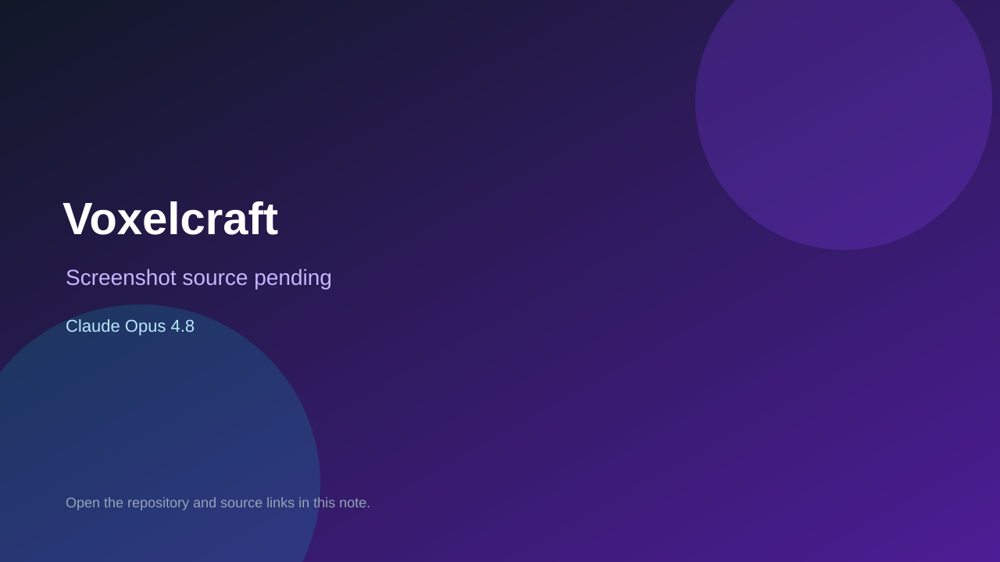

# Voxelcraft

> Verified game note.

## At a glance

- **Score:** 8.9/10
- **Model:** Claude Opus 4.8
- **Technology:** Bevy, Rust, wgpu, Native desktop
- **Verified:** 2026-09-10
- **Repository:** [https://github.com/Eric-lab-star/voxelcraft](https://github.com/Eric-lab-star/voxelcraft)
- **Evidence:** [direct model evidence](https://github.com/Eric-lab-star/voxelcraft/commit/364a4d3d73f51ed49bed229a1f9a17c37416c49b)

## Screenshots

No screenshot source is recorded yet. Keep the placeholder until a repository, awesome list, or creator source provides an image.

## Model attribution

Open the evidence link above. Evidence grade: **direct model evidence**.

## Source description

The README describes a Minecraft-like voxel sandbox with procedural terrain, first-person movement, AABB collision, digging, building, block targeting, chunked meshing, ambient occlusion, water, clouds and day/night. Source includes world, player, interaction, chunks, mesh, particles and save systems. The cited commit page shows a direct Claude Opus 4.8 trailer.

### Gameplay source

- [https://github.com/Eric-lab-star/voxelcraft/blob/main/README.md](https://github.com/Eric-lab-star/voxelcraft/blob/main/README.md)
- [https://github.com/Eric-lab-star/voxelcraft/blob/main/src/world.rs](https://github.com/Eric-lab-star/voxelcraft/blob/main/src/world.rs)
- [https://github.com/Eric-lab-star/voxelcraft/blob/main/src/player.rs](https://github.com/Eric-lab-star/voxelcraft/blob/main/src/player.rs)
- [https://github.com/Eric-lab-star/voxelcraft/blob/main/src/interaction.rs](https://github.com/Eric-lab-star/voxelcraft/blob/main/src/interaction.rs)
- [https://github.com/Eric-lab-star/voxelcraft/commit/364a4d3d73f51ed49bed229a1f9a17c37416c49b](https://github.com/Eric-lab-star/voxelcraft/commit/364a4d3d73f51ed49bed229a1f9a17c37416c49b)

## Verification notes

- **Status:** verified_source
- **Counted units:** 1
- **Discovery:** GitHub commit search for Bevy game Co-Authored-By Claude Opus; https://github.com/Eric-lab-star/voxelcraft

[Back to the awesome list](../../README.md)
