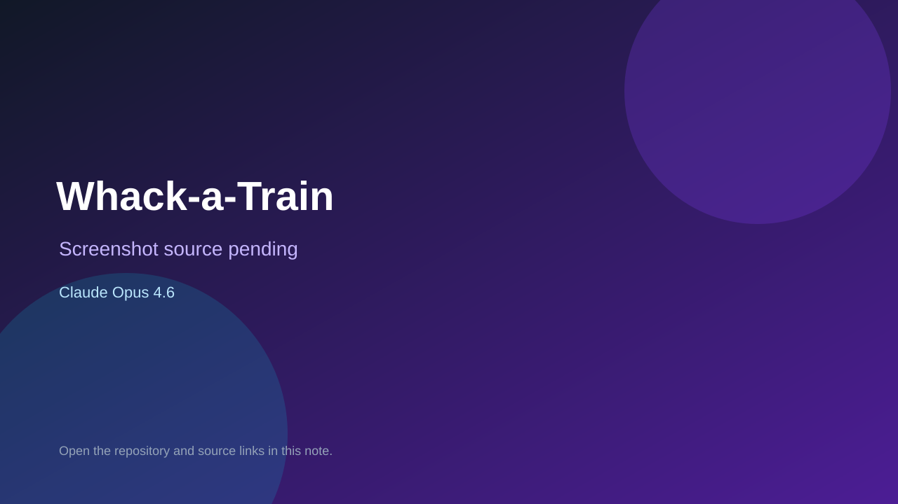

# Whack-a-Train

> Verified game note.

## At a glance

- **Score:** 7.9/10
- **Model:** Claude Opus 4.6
- **Technology:** HTML, JavaScript, Canvas, Browser
- **Verified:** 2026-09-10
- **Repository:** [https://github.com/wsc226/Games](https://github.com/wsc226/Games)
- **Evidence:** [direct model evidence](https://github.com/wsc226/Games/commit/2e8831885fc50d06638ea6a564adab19f2959857)

## Screenshots

No screenshot source is recorded yet. Keep the placeholder until a repository, awesome list, or creator source provides an image.

## Model attribution

Open the evidence link above. Evidence grade: **direct model evidence**.

## Source description

The repository is a launcher with standalone HTML games. The cited commit adds shinkansen.html and a launcher button for Whack-a-Train, an iPad-optimized train-themed whack-a-mole game. The commit carries a Co-Authored-By: Claude Opus 4.6 trailer, and the source contains the playable HTML/JavaScript runtime. Count only this explicitly attributed game.

### Gameplay source

- [https://github.com/wsc226/Games/blob/main/shinkansen.html](https://github.com/wsc226/Games/blob/main/shinkansen.html)
- [https://github.com/wsc226/Games/commit/2e8831885fc50d06638ea6a564adab19f2959857](https://github.com/wsc226/Games/commit/2e8831885fc50d06638ea6a564adab19f2959857)

## Verification notes

- **Status:** verified_source
- **Counted units:** 1
- **Discovery:** GitHub commit search for game Co-Authored-By Claude Opus 4.6; https://github.com/wsc226/Games

[Back to the awesome list](../../README.md)
