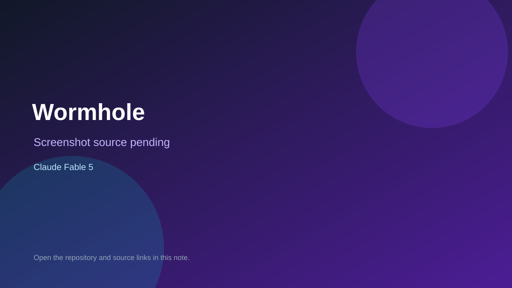

# Wormhole

> Verified game note.

## At a glance

- **Score:** 8.5/10
- **Model:** Claude Fable 5
- **Technology:** TypeScript, Vite, WebGL
- **Verified:** 2026-09-09
- **Repository:** [https://github.com/AidanHT/Wormhole](https://github.com/AidanHT/Wormhole)
- **Evidence:** [creator-reported model evidence](https://github.com/AidanHT/Wormhole/blob/main/README.md)

## Screenshots

No screenshot source is recorded yet. Keep the placeholder until a repository, awesome list, or creator source provides an image.

## Model attribution

Open the evidence link above. Evidence grade: **creator-reported model evidence**.

## Source description

README, src, tests, and deployed app describe a playable first-person portal-puzzle horror game with twelve chambers and momentum puzzles; repository description attributes it to Claude Fable 5.

### Gameplay source

- [https://github.com/AidanHT/Wormhole/blob/main/README.md](https://github.com/AidanHT/Wormhole/blob/main/README.md)

## Verification notes

- **Status:** verified
- **Counted units:** 1
- **Discovery:** https://github.com/AidanHT/Wormhole

[Back to the awesome list](../../README.md)
