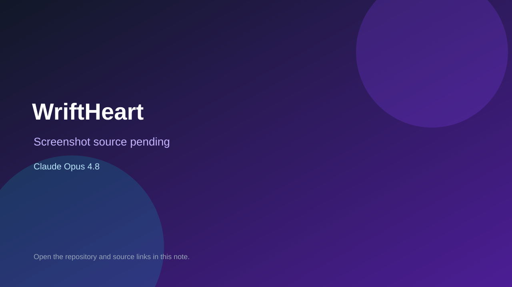

# WriftHeart

> Verified game note.

## At a glance

- **Score:** 9.1/10
- **Model:** Claude Opus 4.8
- **Technology:** Bevy, Rust, Native desktop
- **Verified:** 2026-09-10
- **Repository:** [https://github.com/Baz-Studios-LLC/wriftheart](https://github.com/Baz-Studios-LLC/wriftheart)
- **Evidence:** [direct model evidence](https://github.com/Baz-Studios-LLC/wriftheart/commit/789150805ee0f016a54772529b9ace07d124d606)

## Screenshots

No screenshot source is recorded yet. Keep the placeholder until a repository, awesome list, or creator source provides an image.

## Model attribution

Open the evidence link above. Evidence grade: **direct model evidence**.

## Source description

The README describes an 8-bit native action-adventure RPG with a ten-shard quest, far lands, combat, bosses, towns, characters, items, achievements and a release command. Source contains hero, mobs, attacks, battles, bosses, interiors, quests and save systems. The cited commit page shows a direct Claude Opus 4.8 trailer.

### Gameplay source

- [https://github.com/Baz-Studios-LLC/wriftheart/blob/main/README.md](https://github.com/Baz-Studios-LLC/wriftheart/blob/main/README.md)
- [https://github.com/Baz-Studios-LLC/wriftheart/blob/main/src/app/battle/mod.rs](https://github.com/Baz-Studios-LLC/wriftheart/blob/main/src/app/battle/mod.rs)
- [https://github.com/Baz-Studios-LLC/wriftheart/blob/main/src/actors/hero.rs](https://github.com/Baz-Studios-LLC/wriftheart/blob/main/src/actors/hero.rs)
- [https://github.com/Baz-Studios-LLC/wriftheart/blob/main/src/app/boss/mod.rs](https://github.com/Baz-Studios-LLC/wriftheart/blob/main/src/app/boss/mod.rs)
- [https://github.com/Baz-Studios-LLC/wriftheart/commit/789150805ee0f016a54772529b9ace07d124d606](https://github.com/Baz-Studios-LLC/wriftheart/commit/789150805ee0f016a54772529b9ace07d124d606)

## Verification notes

- **Status:** verified_source
- **Counted units:** 1
- **Discovery:** GitHub commit search for Bevy game Co-Authored-By Claude Opus; https://github.com/Baz-Studios-LLC/wriftheart

[Back to the awesome list](../../README.md)
