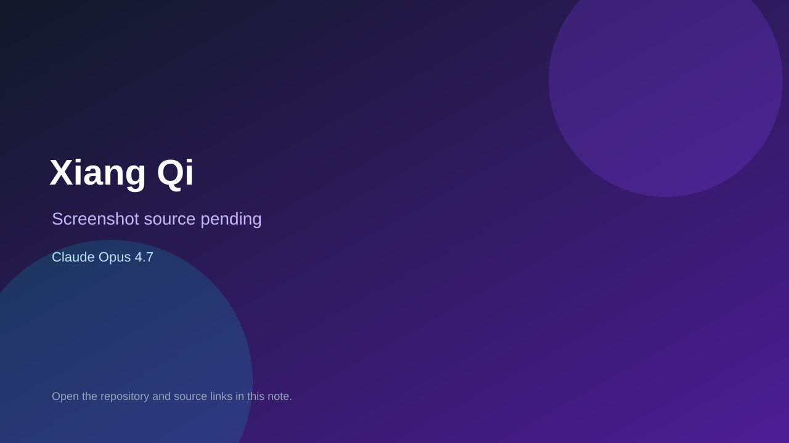

# Xiang Qi

> Verified game note.

## At a glance

- **Score:** 6.5/10
- **Model:** Claude Opus 4.7
- **Technology:** C++, AlphaZero API
- **Verified:** 2026-09-09
- **Repository:** [https://github.com/shuyangsun/az-game-xiang-qi](https://github.com/shuyangsun/az-game-xiang-qi)
- **Evidence:** [creator-reported model evidence](https://github.com/shuyangsun/az-game-xiang-qi/blob/main/README.md)

## Screenshots

No screenshot source is recorded yet. Keep the placeholder until a repository, awesome list, or creator source provides an image.

## Model attribution

Open the evidence link above. Evidence grade: **creator-reported model evidence**.

## Source description

README and C++ source implement Chinese Chess rules and an AlphaZero-compatible game interface; repository description attributes the implementation to Claude Opus 4.7.

### Gameplay source

- [https://github.com/shuyangsun/az-game-xiang-qi/blob/main/README.md](https://github.com/shuyangsun/az-game-xiang-qi/blob/main/README.md)

## Verification notes

- **Status:** verified
- **Counted units:** 1
- **Discovery:** https://github.com/shuyangsun/az-game-xiang-qi

[Back to the awesome list](../../README.md)
