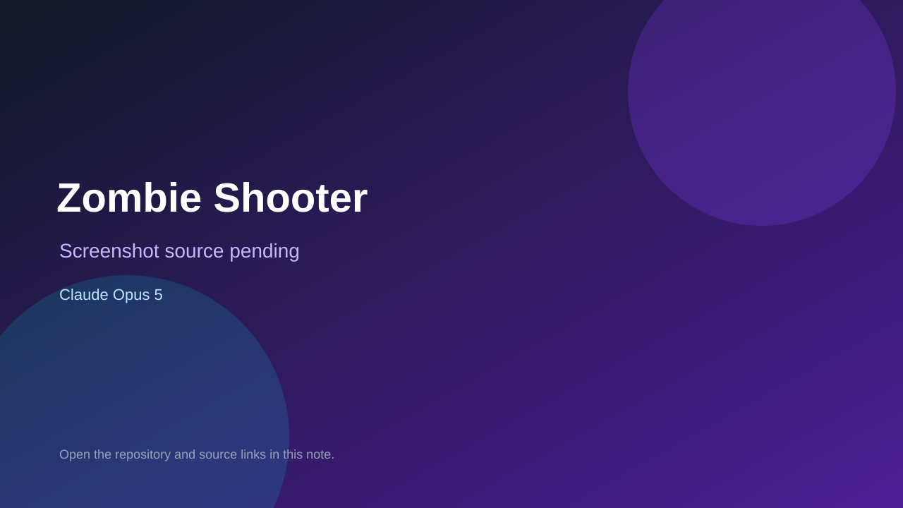

# Zombie Shooter

> Verified game note.

## At a glance

- **Score:** 8.7/10
- **Model:** Claude Opus 5
- **Technology:** HTML, CSS, JavaScript, Canvas 2D, Browser
- **Verified:** 2026-09-12
- **Repository:** [https://github.com/poralmi233-spec/zombie-shooter](https://github.com/poralmi233-spec/zombie-shooter)
- **Evidence:** [direct model evidence](https://github.com/poralmi233-spec/zombie-shooter/commit/abac67d58ab6526ecf45c7be9b0a232e945ba339)
- **Live demo:** [open demo](https://poralmi233-spec.github.io/zombie-shooter/)

## Screenshots

No screenshot source is recorded yet. Keep the placeholder until a repository, awesome list, or creator source provides an image.

## Model attribution

Open the evidence link above. Evidence grade: **direct model evidence**.

## Source description

The repository was created on 2026-09-10. The Russian README documents a 2D survival shooter with WASD movement, mouse aiming, left-click shooting, reload, and dash. game.js implements the Canvas renderer, player state, bullets, zombie spawning and pursuit, damage and collision, health packs, score, HUD, game-over state, restart flow, keyboard and mouse input, and the requestAnimationFrame loop. The GitHub Pages URL returned HTTP 200. The initial gameplay commit contains an exact Co-Authored-By: Claude Opus 5 trailer.

### Gameplay source

- [https://github.com/poralmi233-spec/zombie-shooter#readme](https://github.com/poralmi233-spec/zombie-shooter#readme)
- [https://poralmi233-spec.github.io/zombie-shooter/](https://poralmi233-spec.github.io/zombie-shooter/)
- [https://github.com/poralmi233-spec/zombie-shooter/blob/main/index.html](https://github.com/poralmi233-spec/zombie-shooter/blob/main/index.html)
- [https://github.com/poralmi233-spec/zombie-shooter/blob/main/game.js](https://github.com/poralmi233-spec/zombie-shooter/blob/main/game.js)
- [https://github.com/poralmi233-spec/zombie-shooter/commit/abac67d58ab6526ecf45c7be9b0a232e945ba339](https://github.com/poralmi233-spec/zombie-shooter/commit/abac67d58ab6526ecf45c7be9b0a232e945ba339)

## Verification notes

- **Status:** verified_source
- **Counted units:** 1
- **Discovery:** GitHub commit search for game Co-Authored-By Claude Opus, 2026-09-10..2026-09-12; https://github.com/poralmi233-spec/zombie-shooter

[Back to the awesome list](../../README.md)
